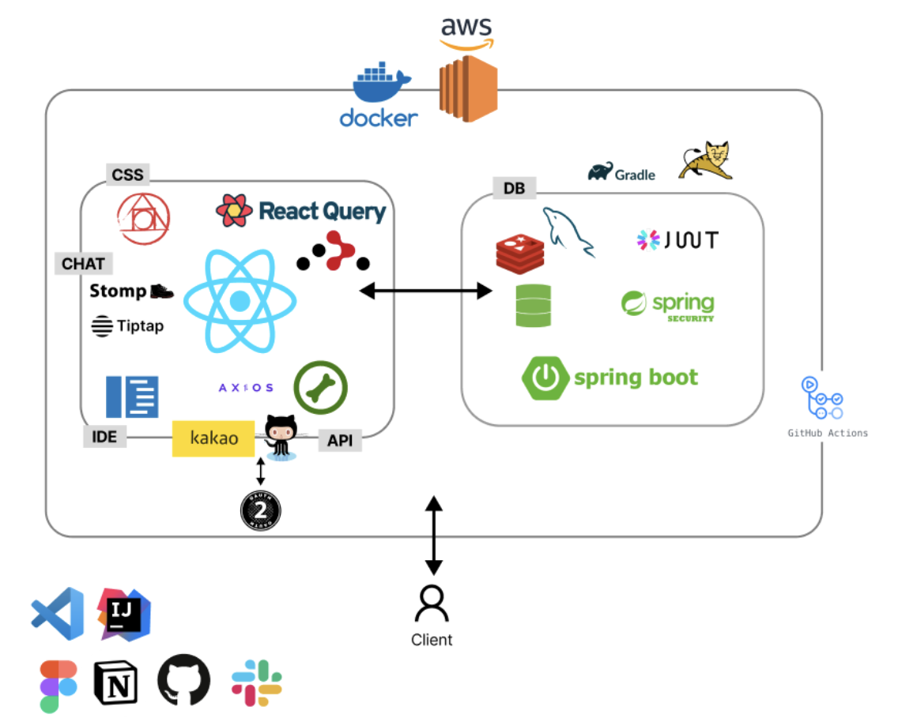
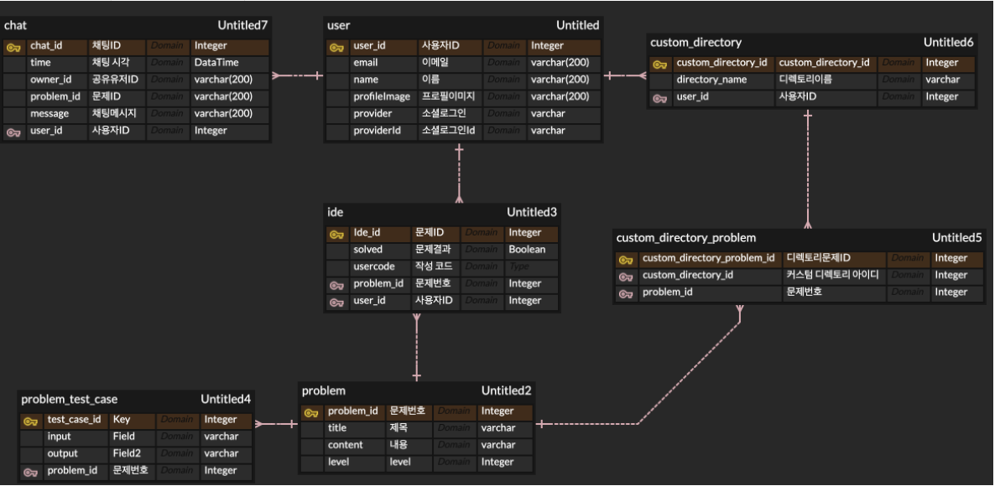
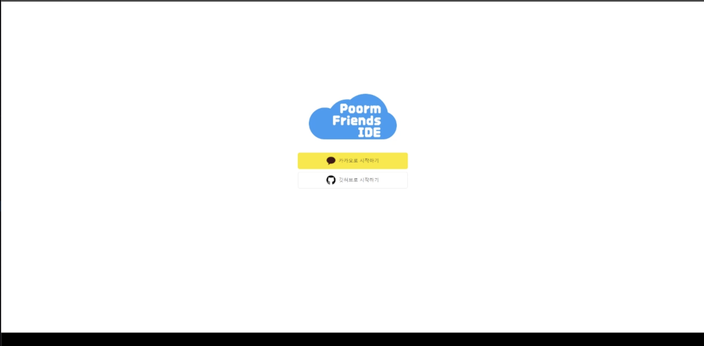
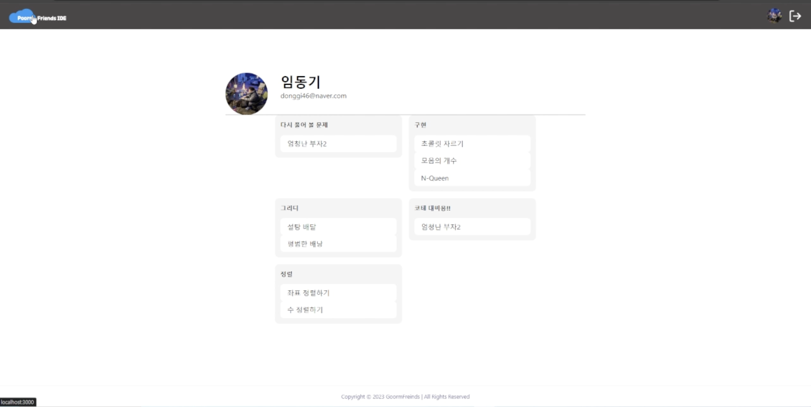
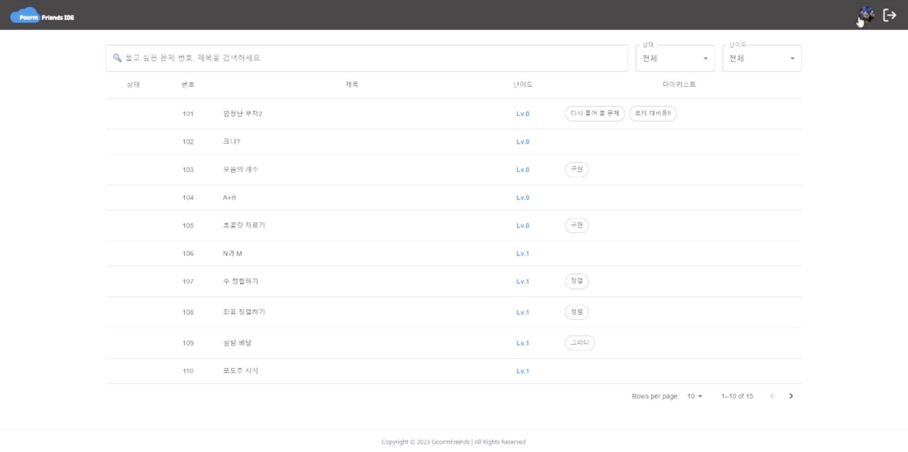
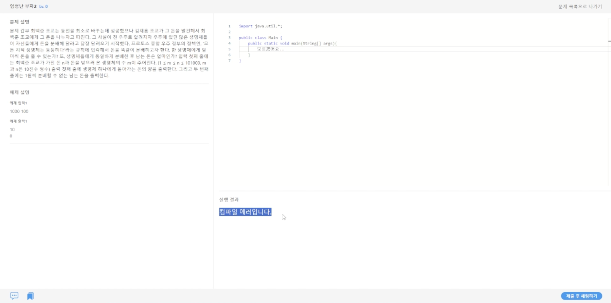
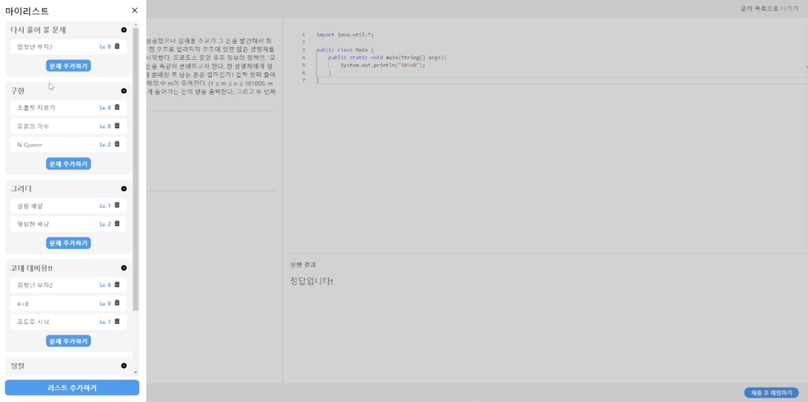
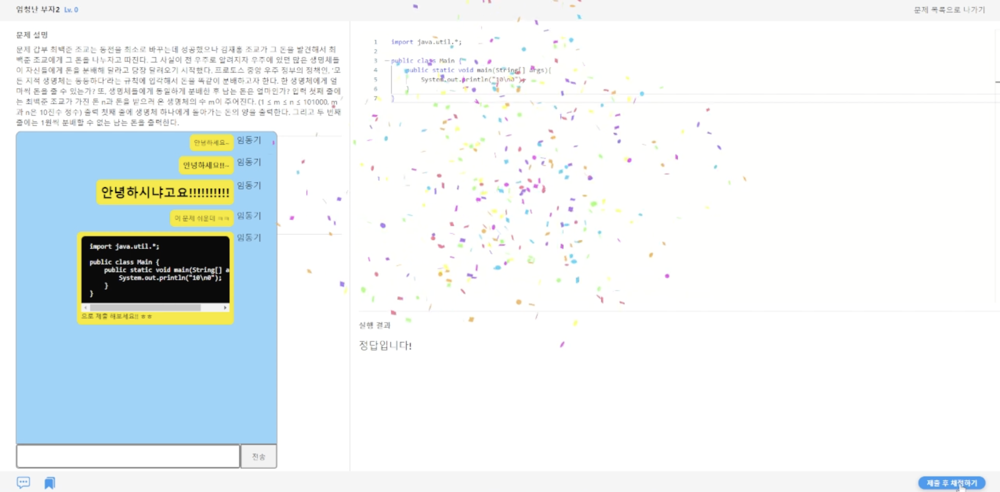

## ☁️POORM_FRIENDS☁️ - 코딩테스트를 위한 WEB IDE

### 🕑프로젝트 기간

2023.12.01 ~ 2023.12.28

### 💡등장 배경

프로그래머스, 백준 같은 서비스를 이용하며 뭔가 허전한 점, 이런 점이 아쉽다는 생각 해보신 적 없으신가요?

프로그래머스처럼 문제와 풀이를 동시에, 백준처럼 나만의 문제집을 만들어, 코딩테스트 풀이 및 제작하였습니다.

### 코딩테스트 실력과 스터디 진행, 두 마리의 토끼를 모두 잡을 수 있도록 구름프렌즈가 도와드리겠습니다!

### 🤔개요

저희 서비스는 알고리즘 문제 풀이에 최적화된 WebIDE 입니다.

알고리즘 문제를 풀고, 채팅을 통해 서로의 코드를 참고하여 풀이 방식을 공유할 수 있습니다.

자신만의 문제집(마이리스트)를 만들어, 편리하게 문제를 찾거나 저장할 수 있습니다.

### 🛠주요 기능

### 채팅

- 채팅 속 마크다운 형식 지원
- SNS 형식의 채팅 UI

### 문제집(마이리스트) 및 문제리스트

- 문제리스트, 마이페이지에서 확인, 수정, 삭제 가능
- 문제리스트 별 필터 기능 (정답 유무, 레벨 별)
- 문제리스트 내 검색 기능

### WEB IDE

- 컴파일 기능 (문제를 풀고 나면, 컴파일 에러, 오답, 정답 등 표시)
- 문제 정답일 경우, 콘페티로 표시

### 기타 기능

- 소셜 로그인 (kakao, github) 지원
- 문제 클릭 시 이동

### ⚙개발 환경 및 기술 스택

**OS**

- Window 10

**Backend - spring**

- JDK: 17
- Spring Boot: 3.2.0
- Gradle
- Spring Security
- Spring Data JPA
- Spring Boot Starter Oauth2 Client
- Spring Boot Starter Validation
- Json Web Token(jwt): 0.11.2
- Spring Boot Starter Data Redis
- Lombok
- Spring Boot Devtools
- Spring Boot Starter Test
- Spring Security Test
- Spring Data Redis
- Spring Boot Starter AOP

**Frontend**

- React

**CI/CD**

- Docker
- Nginx
- github actions

**IDE**

- IntelliJ
- VS Code

**Database**

- DBMS: MySQL
- Cache: Redis

### 🎨시스템 아키텍처 (참고사항)



### 🔀 ERD



### 💾프로젝트 파일 구조

- Backend

```bash
📦backend
 ┣ 📂src
 ┃ ┣ 📂main
 ┃ ┃ ┣ 📂java
 ┃ ┃ ┃ ┗ 📂com.goorm.goormfriends
 ┃ ┃ ┃ │ ┣ 📂api
 ┃ ┃ ┃ │ ┃ ┣ 📂compiler
 ┃ ┃ ┃ │ ┃ ┃ ┣ 📂core
 ┃ ┃ ┃ │ ┃ ┃ ┃ ┣ 📜IdeController.java
 ┃ ┃ ┃ │ ┃ ┃ ┃ ┣ 📜IdeRequest.java
 ┃ ┃ ┃ │ ┃ ┃ ┃ ┣ 📜IdeResponse.java
 ┃ ┃ ┃ │ ┃ ┃ ┃ ┗ 📜WrapperResponse.java
 ┃ ┃ ┃ │ ┃ ┃ ┗ 📂service
 ┃ ┃ ┃ │ ┃ ┃ ┃ ┣ 📜IdeCompiler.java
 ┃ ┃ ┃ │ ┃ ┃ ┃ ┣ 📜IdeCompilerService.java
 ┃ ┃ ┃ │ ┃ ┃ ┃ ┣ 📜IdeService.java
 ┃ ┃ ┃ │ ┃ ┃ ┃ ┣ 📜MemoryClassLoader.java
 ┃ ┃ ┃ │ ┃ ┃ ┃ ┗ 📜MemoryJavaFileManager.java
 ┃ ┃ ┃ │ ┃ ┣ 📂controller
 ┃ ┃ ┃ │ ┃ ┃ ┣ 📜DirectoryController.java
 ┃ ┃ ┃ │ ┃ ┃ ┣ 📜ProblemController.java
 ┃ ┃ ┃ │ ┃ ┃ ┣ 📜UserController.java
 ┃ ┃ ┃ │ ┃ ┃ ┗ 📜WebSocketController.java
 ┃ ┃ ┃ │ ┃ ┣ 📂dto
 ┃ ┃ ┃ │ ┃ ┃ ┣ 📂criteria
 ┃ ┃ ┃ │ ┃ ┃ ┃ ┗ 📜ProblemSearchCriteria.java
 ┃ ┃ ┃ │ ┃ ┃ ┣ 📂redis
 ┃ ┃ ┃ │ ┃ ┃ ┃ ┣ 📜RedisPublisher.java
 ┃ ┃ ┃ │ ┃ ┃ ┃ ┗ 📜RedisSubscriber.java
 ┃ ┃ ┃ │ ┃ ┃ ┣ 📂request
 ┃ ┃ ┃ │ ┃ ┃ ┃ ┣ 📜ChatMessageRequest.java
 ┃ ┃ ┃ │ ┃ ┃ ┃ ┣ 📜CreateDirectoryRequest.java
 ┃ ┃ ┃ │ ┃ ┃ ┃ ┣ 📜DeleteDirectoryRequest.java
 ┃ ┃ ┃ │ ┃ ┃ ┃ ┣ 📜DirectoryProblemRequest.java
 ┃ ┃ ┃ │ ┃ ┃ ┃ ┣ 📜UpdateDirectoryRequest.java
 ┃ ┃ ┃ │ ┃ ┃ ┃ ┗ 📜UpdateUserInfoRequest.java
 ┃ ┃ ┃ │ ┃ ┃ ┗ 📂response
 ┃ ┃ ┃ │ ┃ ┃ ┃ ┣ 📜CustomDirectoryInfo.java
 ┃ ┃ ┃ │ ┃ ┃ ┃ ┣ 📜DirectoryListResponse.java
 ┃ ┃ ┃ │ ┃ ┃ ┃ ┣ 📜DirectoryProblemResponse.java
 ┃ ┃ ┃ │ ┃ ┃ ┃ ┣ 📜LoginResponse.java
 ┃ ┃ ┃ │ ┃ ┃ ┃ ┣ 📜ProblemDetailsResponse.java
 ┃ ┃ ┃ │ ┃ ┃ ┃ ┣ 📜ProblemResponse.java
 ┃ ┃ ┃ │ ┃ ┃ ┃ ┣ 📜TestCaseInfo.java
 ┃ ┃ ┃ │ ┃ ┃ ┃ ┗ 📜UserInfoRespone.java
 ┃ ┃ ┃ │ ┃ ┗ 📂service
 ┃ ┃ ┃ │ ┃ ┃ ┣ 📜ChatService.java
 ┃ ┃ ┃ │ ┃ ┃ ┣ 📜DirectoryService.java
 ┃ ┃ ┃ │ ┃ ┃ ┣ 📜DirectoryServiceImpl.java
 ┃ ┃ ┃ │ ┃ ┃ ┣ 📜ProblemService.java
 ┃ ┃ ┃ │ ┃ ┃ ┣ 📜UserService.java
 ┃ ┃ ┃ │ ┃ ┃ ┗ 📜UserServiceImpl.java
 ┃ ┃ ┃ │ ┣ 📂common
 ┃ ┃ ┃ │ ┃ ┣ 📂jwt
 ┃ ┃ ┃ │ ┃ ┃ ┣ 📜JwtAuthenticationEntryPoint.java
 ┃ ┃ ┃ │ ┃ ┃ ┗ 📜TokenProvider.java
 ┃ ┃ ┃ │ ┃ ┗ 📂oauth
 ┃ ┃ ┃ │ ┃ ┃ ┣ 📜GithubUserInfo.java
 ┃ ┃ ┃ │ ┃ ┃ ┣ 📜KakaoUserInfo.java
 ┃ ┃ ┃ │ ┃ ┃ ┣ 📜OAuth2UserInfo.java
 ┃ ┃ ┃ │ ┃ ┃ ┣ 📜PrincipalDetails.java
 ┃ ┃ ┃ │ ┃ ┃ ┗ 📜PrincipalOauth2UserService.java
 ┃ ┃ ┃ │ ┣ 📂conig
 ┃ ┃ ┃ │ ┃ ┣ 📜JwtSecurityConfig.java
 ┃ ┃ ┃ │ ┃ ┣ 📜RedisConfig.java
 ┃ ┃ ┃ │ ┃ ┣ 📜SecurityConfig.java
 ┃ ┃ ┃ │ ┃ ┗ 📜WebSocketConfig.java
 ┃ ┃ ┃ │ ┣ 📂db
 ┃ ┃ ┃ │ ┃ ┣ 📂entity
 ┃ ┃ ┃ │ ┃ ┃ ┣ 📜BaseTimeEntity.java
 ┃ ┃ ┃ │ ┃ ┃ ┣ 📜ChatMessage.java
 ┃ ┃ ┃ │ ┃ ┃ ┣ 📜CustomDirectory.java
 ┃ ┃ ┃ │ ┃ ┃ ┣ 📜CustomDirectoryProblem.java
 ┃ ┃ ┃ │ ┃ ┃ ┣ 📜Ide.java
 ┃ ┃ ┃ │ ┃ ┃ ┣ 📜Problem.java
 ┃ ┃ ┃ │ ┃ ┃ ┣ 📜ProblemTestCase.java
 ┃ ┃ ┃ │ ┃ ┃ ┣ 📜RefreshToken.java
 ┃ ┃ ┃ │ ┃ ┃ ┣ 📜State.java
 ┃ ┃ ┃ │ ┃ ┃ ┗ 📜User.java
 ┃ ┃ ┃ │ ┃ ┗ 📂repository
 ┃ ┃ ┃ │ ┃ ┃ ┣ 📜ChatMessageRepository.java
 ┃ ┃ ┃ │ ┃ ┃ ┣ 📜CustomDirectoryProblemRepository.java
 ┃ ┃ ┃ │ ┃ ┃ ┣ 📜CustomDirectoryRepository.java
 ┃ ┃ ┃ │ ┃ ┃ ┣ 📜IdeRepository.java
 ┃ ┃ ┃ │ ┃ ┃ ┣ 📜ProblemRepository.java
 ┃ ┃ ┃ │ ┃ ┃ ┣ 📜ProblemTestCaseRepository.java
 ┃ ┃ ┃ │ ┃ ┃ ┣ 📜RefreshTokenRepository.java
 ┃ ┃ ┃ │ ┃ ┃ ┗ 📜UserRepository.java
 ┃ ┃ ┃ │ ┣ 📂filter
 ┃ ┃ ┃ │ ┃ ┗ 📜JwtFilter.java
 ┃ ┃ ┃ │ ┣ 📂handler
 ┃ ┃ ┃ │ ┃ ┣ 📜JwtAccessDeniedHandler.java
 ┃ ┃ ┃ │ ┃ ┣ 📜OAuth2AuthenticationFailureHandler.java
 ┃ ┃ ┃ │ ┃ ┗ 📜OAuth2AuthenticationSuccessHandler.java
 ┃ ┃ ┃ │ ┣ 📂util
 ┃ ┃ ┃ │ ┃ ┣ 📜CookieUtil.java
 ┃ ┃ ┃ │ ┃ ┗ 📜SecurityUtil.java
 ┗ ┗ ┗ ┗ ┗ 📜GoormfriendsApplication.java
 ```
 
 - Frontend

```bash
FE
├─ src
│  ├─ api
│  ├─ assets
│  │  ├─ chatbot
│  │  ├─ icon
│  │  ├─ image
│  │  │  ├─ achievement
│  │  │  ├─ emotion
│  │  │  ├─ hair
│  │  │  ├─ pants
│  │  │  ├─ pet
│  │  │  └─ shirt
│  │  └─ minimi_temp
│  ├─ components
│  │  ├─ BasicComp
│  │  ├─ BoardComp
│  │  │  └─ CommentComp
│  │  ├─ FollowComp
│  │  ├─ GuestBookComp
│  │  ├─ MainPageComp
│  │  ├─ NotifyComp
│  │  ├─ StatisticComp
│  │  └─ UserComp
│  ├─ router
│  └─ views
│     ├─ BoardView
│     └─ UserView
│        ├─ findpw
│        ├─ login
│        ├─ modify
└────────└─ register
```

### 👨🏻‍🤝‍👨🏻협업 툴

- Notion
- Git
- Zep
- Slack
- Discord

### 👨🏻‍🤝‍👨🏻협업 환경

- Gitlab
  - 코드의 버전 관리
  - MR시, 팀원이 코드 리뷰를 진행하고 피드백 게시
- Notion
  - 회의가 있을때마다 회의록을 기록하여 보관
  - 기술 확보 시, 다른 팀원들도 추후 따라할 수 있도록 보기 쉽게 작업 순서대로 정리
  - 컨벤션 정리
  - 간트차트 활용한 개발 계획 관리
  - 스토리 보드, 시퀀스 다이어그램, 기능 명세서 등 팀원 모두가 공유해야 하는 문서 관리
- Discord, Zep
  - 회의 및 기능 구현, 개발 진행 상황 파악
  - 온라인 개발 진행할 때 서로 공유

### 😎팀원 역할

- 이다희
  - 팀장
  - Frontend
  - IDE 페이지, 마이리스트, FE 코드 리펙토링
- 강수영
  - FE 파트장
  - Frontend
  - 소셜 로그인, 마이페이지, 배포
- 변유정
  - 프로젝트 매니저
  - Backend
  - 소셜 로그인, 마이리스트 API, 채팅
- 임동기
  - 서기 및 발표
  - Frontend
  - 문제 리스트 페이지, 채팅
- 임소라
  - BE 파트장
  - Backend
  - 코드 컴파일 기능, 배포
- 한석규
  - 기술 문서 담당
  - Backend
  - 문제 리스트 API, IDE 데이터 및 테스트케이스 API, 배포

### 🎞기능 소개 및 화면 (참고 사항)

### 메인 및 로그인



- Kakao, github로그인 등을 선택할 수 있는 화면

### 마이페이지



- 개인 정보 및 마이리스트(문제집) 확인 가능

### 메인 페이지(문제리스트)



- 문제 리스트 및 각 문제 정답 여부 확인 가능
- 필터 및 검색 가능

### IDE 페이지





- 문제 내용 및 예제 테스트 케이스, 개인 작성 코드 확인 가능
- 채팅 및 마이리스트(문제집) 기능 사용 가능
- 정답일 경우, 콘페티로 구현

### 채팅


- 닉네임, 색 표시로 채팅 구분 및 마크다운 형식 지원으로 코드 공유 가능
- 실시간 채팅 기능